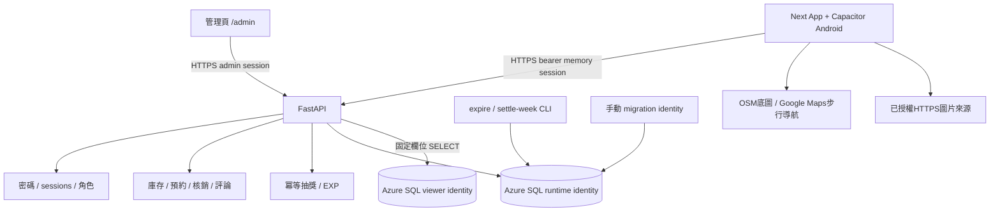
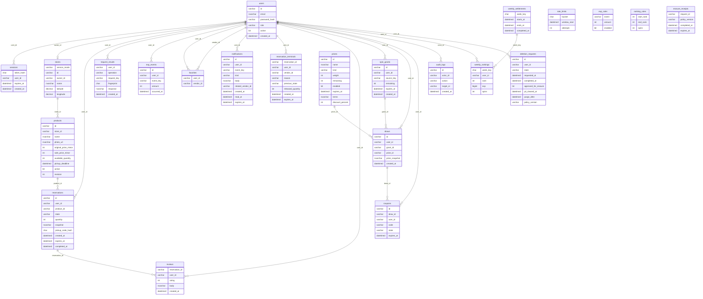

# 系統與資料表關係（目前程式）

來源：migration001–011。本圖是新版source設計：部署端先前確認001–005，006–011尚未套用或真SQL驗證。精確權限與ownership-chain邊界見SQL011_SECURITY_REVIEW.md。

正式模式API失敗不切回demo。登入token只在記憶體；裝置只保存未完成操作識別碼與內容雜湊。後端token存hash，會話12小時；刪除申請立即停用帳號／撤銷session，但資料抹除仍待營運流程。新版schema011及新增權限尚未套用。

另有migration runner建立的schema_migrations(version, applied_at)。request_results保存冪等操作結果；預約取貨碼只向本人API回傳，DB viewer不公開它。ranking_rules與exp_rules為配置表，以程式套用，不捏造不存在的FK。rate_limits為匿名雜湊bucket，不儲存原始IP。

004新增owner清除狀態及無user FK的限時回執。owner工具預設停用；清除前公開狀態可用原密碼，清除密碼後由owner依回執協助。真SQL清除與外部备份流程未驗證，詳見ERASURE_RUNBOOK。

005：API既有交易內呼叫dbo.submit_deletion_request(request_id,user_id)，程序固定未批准及空清除欄位。runtime僅此procedure EXECUTE，不能直接寫申請表或讀owner欄位；不自動執行erasure。

006保證非NULL owner至多一store。007 terminal.reservation_id刻意無order FK，vendor_id及notification.related_vendor_id也無vendor FK；可先移除業務資料，再依owner policy清除識別。008–011固定procedure透過同dbo ownership chain操作，runtime不取得直接業務DELETE。
